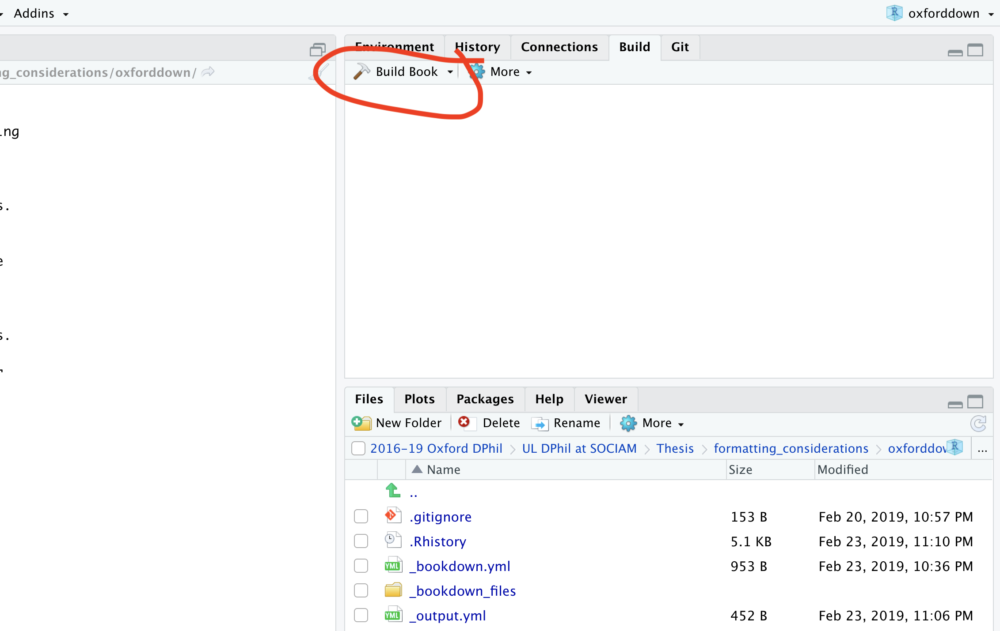
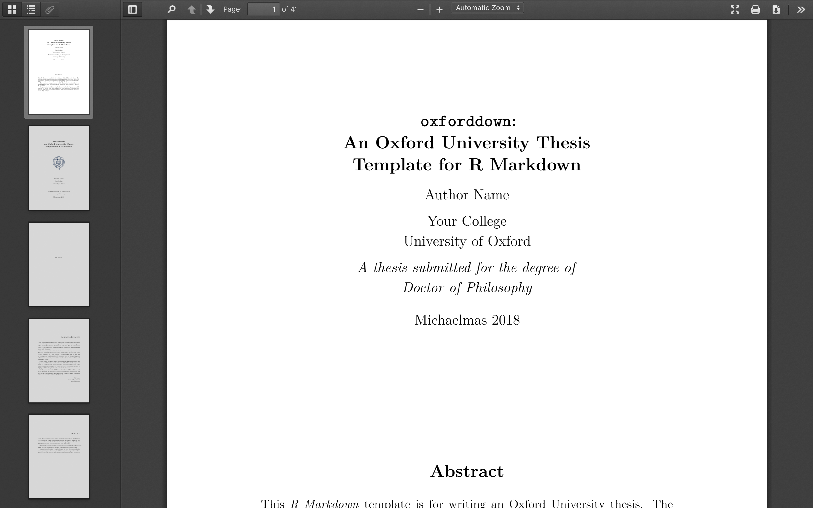

# Oxforddown

A template for writing an Oxford University thesis in R Markdown.

The template uses the [bookdown](https://bookdown.org) R package together with the [OxThesis LaTeX template](https://github.com/mcmanigle/OxThesis), plus lots and lots of inspiration and sample content from [thesisdown](https://github.com/ismayc/thesisdown).

# Requirements
- LaTeX - if you're lazy and got sufficient disc space, just download and install the MacTeX distribution from [tug.org/mactex/](http://www.tug.org/mactex/). If you're short on disc space, go for the BasicTeX distribution from the same site, or Yihui Xie's [TinyTeX](https://yihui.name/tinytex/).
- [R](https://cran.rstudio.com) and [RStudio](https://www.rstudio.com/products/rstudio/download/) - for the latter, I recommend installing the latest [preview version of RStudio version 1.2](https://www.rstudio.com/products/rstudio/download/preview/) which includes some fantastically useful features.
- a number of R packages (including `bookdown` and `thesisdown`) which should (hopefully) be automatically installed for you (if you don't have them already) when you knit this project for the first time in RStudio

# Example output
- PDF output: see [**docs/_main.pdf**](https://github.com/ulyngs/oxforddown/blob/master/docs/_main.pdf)
- Gitbook output: see [ulyngs.github.io/oxforddown/](https://ulyngs.github.io/oxforddown/)

# Usage
- clone the **ulyngs/oxforddown** repo or download it as a zip
- open **oxforddown.Rproj** in RStudio
- click 'Build Book' on the 'Build' tab (or click its dropdown arrow and choose either `bookdown::pdf_book` or `bookdown::git_book`), or open index.Rmd and click 'knit', to compile the book with sample content
- please note that I haven't implemented word output yet - it might work but no guarantees!

To use this template to write your thesis, do the following:
- set meta data (your name etc) in **index.Rmd**
- write the individual chapters, as well as abstract and acknowledgements, as **.Rmd** files in **text/**
- note that **.Rmd** files you don't want included in the body text must be given file names that begin with an underscore (e.g. **text/\_abstract.Rmd** and **text/\_acknowledgements.Rmd**) - alternatively, you can specify manually in **\_bookdown.yml** which files should be merged into the body text)

This project will in time be turned into an R package that supply the template as an R Markdown template within RStudio.

Enjoy!
