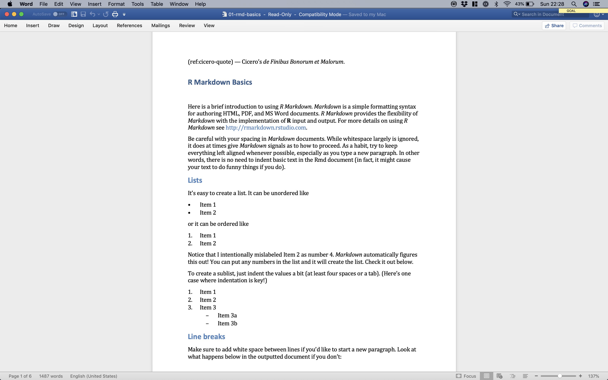

# Oxforddown

A template for writing an Oxford University thesis in R Markdown.

The template uses the [bookdown](https://bookdown.org) R package together with the [OxThesis LaTeX template](https://github.com/mcmanigle/OxThesis), plus lots and lots of inspiration and sample content from [thesisdown](https://github.com/ismayc/thesisdown).

# Requirements
- LaTeX - if you're lazy and got sufficient disc space, just download and install the MacTeX distribution from [tug.org/mactex/](http://www.tug.org/mactex/). If you're short on disc space, go for the BasicTeX distribution from the same site, or Yihui Xie's [TinyTeX](https://yihui.name/tinytex/).
- [R](https://cran.rstudio.com) and [RStudio version 1.2 preview](https://www.rstudio.com/products/rstudio/download/preview/)
- (pandoc version 2 or higher - comes bundled with RStudio v1.2 preview)
- a number of R packages (including `bookdown` and `thesisdown`) which should (hopefully) be automatically installed for you (if you don't have them already) when you knit this project for the first time in RStudio

# Example output
- PDF output: see [**docs/_main.pdf**](https://github.com/ulyngs/oxforddown/blob/master/docs/_main.pdf)
- Gitbook output: see [ulyngs.github.io/oxforddown/](https://ulyngs.github.io/oxforddown/)

# Usage
- clone the **ulyngs/oxforddown** repo or download it as a zip
- open **oxforddown.Rproj** in RStudio

## Compiling the thesis
### PDF output
- click 'Build Book' on the 'Build' tab
- the compiled PDF (and the **.tex** file) is saved as **docs/\_main.pdf**, and the PDF is opened in the RStudio Viewer

### Gitbook output
- in the terminal (not the R console!) tab, type 'make gitbook'
- the set of HTML files for the gitbook are stored in the **docs/** folder, and the front page (docs/index.html) is opened in a browser

## Writing your thesis
To use this template to write your thesis, do the following:
- update the YAML header (the stuff at the top between '---') in **index.Rmd** with your name, college, etc.
- write the individual chapters, as well as abstract and acknowledgements, as **.Rmd** files in the folder **text/**
- for abbreviations, change **text/abbreviations.tex** to fit your needs (for now, follow the LaTeX syntax in the sample file)
- note that **.Rmd** files you don't want included in the body of your thesis must be given file names that begin with an underscore (e.g. **text/\_abstract.Rmd** and **text/\_acknowledgements.Rmd**) - alternatively, specify manually in **\_bookdown.yml** which files should be merged into the body text -  otherwise knitr will try include them when you build the thesis

## Knitting individual chapters
You might want to knit just an individual chapter without compiling the entire thesis. To do this:
1. open the **.Rmd** file of a chapter you'd like to knit
2. add a YAML header, specifying the output formats you might want (e.g. `bookdown::word_document2` for a word document that you might want to upload to Google Docs for feedback from collaborators; NOTE: use the [bookdown formats](https://bookdown.org/yihui/bookdown/a-single-document.html), rather than the plain rmarkdown ones (e.g. rmarkdown::word_document) to include cross-referencing ability
3 click the dropdown arrow to the right of the 'knit' button, and make sure 'Knit Directory' is set to 'Project Directory'
4. choose the output format you want to knit to

The output file is then saved in **text/**.

Tip: To remove your knitted chapters and their supporting files (e.g.  \*\_cache and \*\_files/), type `make clean-previews` in the terminal tab.

# Current limitations
- at the moment only PDF and HTML output have been properly implemented; I will improve on the Word output further down the line

This project will in time be turned into an R package that supply the template as an R Markdown template within RStudio.

Enjoy!
