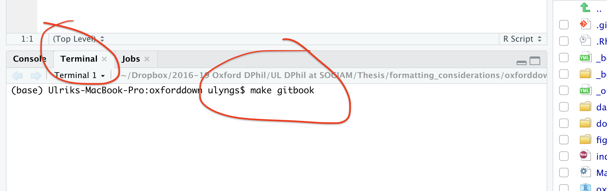

Contents
=================
- [Requirements](#requirements)
- [Video tutorials](#video-tutorials)
- [How to use](#how-to-use)
  * [Writing your thesis](#writing-your-thesis)
  * [Building your entire thesis](#building-your-entire-thesis)
    + [PDF output](#pdf-output)
    + [Gitbook output](#gitbook-output)
    + [BS4 book output](#bs4-book-output)
    + [Word output](#word-output)
  * [Building a single chapter](#building-a-single-chapter)
  * [Cleaning up generated auxiliary files](#cleaning-up-generated-auxiliary-files)
- [Customisations and extensions](#customisations-and-extensions)
- [Limitations](#limitations)
  * [Gotchas](#gotchas)
  * [Output formats](#output-formats)

# Oxforddown
A template for writing an Oxford University thesis in R Markdown. The template uses the [bookdown](https://bookdown.org) R package together with the [OxThesis LaTeX template](https://github.com/mcmanigle/OxThesis), plus lots of inspiration from [thesisdown](https://github.com/ismayc/thesisdown).

- Sample PDF output: [**docs/_main.pdf**](https://github.com/ulyngs/oxforddown/blob/master/docs/_main.pdf)
- Sample BS4 book output: [ulyngs.github.io/oxforddown/](https://ulyngs.github.io/oxforddown/)

Examples of theses written with `oxforddown`:
- [Ulysses in Cyberspace: Examining the Effectiveness of Design Patterns for Digital Self-Control](https://ulyngs.github.io/phd-thesis/) by [Ulrik Lyngs](https://ulriklyngs.com)
- [Teens, Screens and Wellbeing: An Improved Approach](https://www.amyorben.com/docs/thesis/index.html) by [Amy Orben](https://www.amyorben.com)

*NOTE: If you've used this template to write your thesis, drop me a line at ulrik.lyngs@cs.ox.ac.uk and I'll add a link showcasing it!*

## How to cite
[](https://zenodo.org/badge/latestdoi/159745024)

```bibtex
@misc{lyngsOxforddown2019,
  author = {Lyngs, Ulrik},
  title = {oxforddown: An Oxford University Thesis Template for R Markdown},
  year = {2019},
  publisher = {GitHub},
  journal = {GitHub repository},
  howpublished = {\url{https://github.com/ulyngs/oxforddown}},
  doi = {10.5281/zenodo.3484682},
}
```

## Video tutorials
NOTE: as per v2.0, the introduction chapter no longer needs to be named \_introduction.Rmd! Apart from this, the videos should still be mostly right!

See the video tutorials for how to use the template:

- [Part 1: Building the entire thesis](https://www.youtube.com/watch?v=Yf1W1BBS9cU)
- [Part 2: Building a single chapter](https://www.youtube.com/watch?v=-EJfCA3VA-I)
- [Part 3: Understanding the file structure](https://www.youtube.com/watch?v=jafgJobOgpc)
- [Part 4: A walk-through example of creating your thesis](https://www.youtube.com/watch?v=uWpinaVSZ6Q)
- [Part 5: The content included in index.Rmd (or: why the introduction chapter is special)](https://www.youtube.com/watch?v=FPlwCj5ZH8M)
- [Part 6: Adjusting the order of chapters](https://www.youtube.com/watch?v=-0M3TuDnu7Y)
- [Part 7: \_bookdown.yml: Adjusting build settings](https://www.youtube.com/watch?v=jXYfC8RXTvg)
- [Part 8: Makefile: Adjusting build settings](https://www.youtube.com/watch?v=L6mV8z32RfE)
- [Part 9: The LaTeX templates](https://www.youtube.com/watch?v=o2fd_O1On7g)


For how to write your content with the R Markdown syntax, read through the sample content.


## Requirements
- LaTeX 
  - Option 1 (recommended): 
    - Mac: download and install MacTeX from [tug.org/mactex/](http://www.tug.org/mactex/) (~4 gigs)
    - Windows: download and install MikTex from [miktex.org](https://miktex.org)
  - Option 2 (not recommended): 
    - install [TinyTeX](https://yihui.name/tinytex/), a minimal LaTeX installation intended for use with R Markdown.
    - manually install the LaTeX package 'cbfonts-fd' by running `tinytex::tlmgr_install('cbfonts-fd')` in an R console - TinyTeX will automatically install other necessary LaTeX packages for you when you build to PDF for the first time
    - *the reason I do not recommend this option is because several `oxforddown` users (#11) (including myself) have found that some necessary packages (e.g. for writing Greek symbols) are not installed by TinyTeX for reasons that are not clear*
- [R](https://cran.rstudio.com) and [RStudio version 1.2 or higher](https://www.rstudio.com/products/rstudio/download/#download)
- The R packages `rmarkdown`, `bookdown`, `tidyverse`, `kableExtra`, and `here`
- *If on Mac*
  - Command line developer tools. You can install these by typing `xcode-select --install` in a terminal prompt
- *If on Windows*
  - The 'Build all' button is set up to use a program called [`make`](https://thomasleeper.com/2016/09/make-make-make-again/) to build the pdf output and automatically clean up all the weird files LaTeX generates in the process. 
  - `make` can be tricky to install on Windows, so the route of least pain on Windows is to instead build the thesis by knitting **index.Rmd** or running `bookdown::render_book("index.Rmd", output_format = "bookdown::pdf_book")` in the R console (the only drawback is that this does not clean up many of the files generated by LaTeX when building the thesis).
  
  If you still want to use 'make', here's how: \
    Option 1 (quite painful): 
    - (i) download the minGW installer from https://sourceforge.net/projects/mingw/, 
    - (ii) open the MinGW Installation Manager, check the box next to mingw32-base and select 'Mark for installation'
    - (iii) click 'Installation' then 'Apply changes'
    - (iv) make a copy of the file 'mingw32-make.exe' which you will probably find in the folder **C:\MinGW\bin\\**, and name it **make.exe**
    - (v) include this in your environment variables, by opening a terminal / command prompt and typing `set PATH=C:\MinGW\bin;%PATH%`

    Option 2 (supposedly less painful):
    - (i) install the package manager chocolatey from [here](https://chocolatey.org/install)
    - (ii) open a command prompt and type `choco install make`


## How to use
- download the **ulyngs/oxforddown** repo as a zip
- open **oxforddown.Rproj** in RStudio

### Writing your thesis
- update the YAML header (the stuff at the top between '---') in **index.Rmd** with your name, college, etc.
- write the individual chapters as **.Rmd** files in the root folder
- write the front matter (abstract, acknowledgements, abbreviations) and back matter (appendices) by adjusting the **.Rmd** files in the **front-and-back-matter/** folder
- for abbreviations, change **front-and-back-matter/abbreviations.tex** to fit your needs (follow the LaTeX syntax in there)

**.Rmd** files you don't want included in the body text must be given file names that begin with an underscore (e.g. **front-and-back-matter/\_abstract.Rmd** and **front-and-back-matter/\_acknowledgements.Rmd**). (Alternatively, specify manually in **\_bookdown.yml** which files should be merged into the body text.)

### Building your entire thesis
#### PDF output
- options
  - *using `make`*: type 'make pdf' in the terminal (not the R console!) *or* click 'Build All' on the 'Build' tab
  - knit the **index.Rmd** file *or* 
  - run `bookdown::render_book("index.Rmd", output_format = "bookdown::pdf_book")` in the R console
- the compiled PDF is saved as **docs/\_main.pdf**


#### Gitbook output
- options
  - in the terminal tab (not the R console!), type `make gitbook` *or*
  - run `bookdown::render_book("index.Rmd", output_format = "bookdown::gitbook")` in the R console
- the set of HTML files for the gitbook are stored in the **docs/** folder, and the front page (docs/index.html) is opened in a browser
- (Note that if you want to deploy your thesis as a gitbook on GitHub Pages, there must be a **.nojekyll** file in the **docs/** folder, otherwise GitHub does some voodoo that causes some filepaths not to work - this file is automatically generated by oxforddown when you build to gitbook)




#### BS4 book output
- for this to work, you must install (1) the latest development version of bookdown (`remotes::install_github('rstudio/bookdown')`), (2) the `downlit` package (`install.packages("downlit")`), (3) the `bslib` package (not on CRAN yet; install with `remotes::install_github("rstudio/bslib")`)
- options
  - in the terminal tab, type `make bs4book` *or*
  - run `bookdown::render_book("index.Rmd", output_format = "bookdown::gitbook")` in the R console
- the set of HTML files are stored in the **docs/** folder, and (for option 1) the front page (docs/index.html) is opened in a browser

#### Word output
- options
  - in the terminal tab, type 'make word'
  - run `bookdown::render_book("index.Rmd", output_format = "bookdown::word_document2")` in the R console
- the compiled MS Word document is saved as **docs/\_main.docx**

The Word output has no templates behind it, and many things do not work (e.g. image rotation, highlighting corrections). **I encourage pull requests that optimise the Word output, e.g. by using tools from the [`officer`](https://github.com/davidgohel/officer) package.**

### Building a single chapter
To knit an individual chapter without compiling the entire thesis:

1. open the **.Rmd** file of a chapter
2. add a YAML header specifying the output format(s) (e.g. `bookdown::word_document2` for a word document you might want to upload to Google Docs for feedback from collaborators)
3. Click the `knit` button (the output file is then saved in the root folder)

As shown in the sample chapters' YAML headers, to output a single chapter to PDF, use:

```yaml
output:
  bookdown::pdf_document2:
    template: templates/brief_template.tex
    citation_package: biblatex
documentclass: book
bibliography: references.bib
```
**brief_template.tex** formats the chapter in the OxThesis style but without including the front matter (table of contents, abstract, etc).

(Also, if you do not set the option `citation_package: biblatex`, which tell R Markdown to use BibLaTeX, you will get the error "! LaTeX Error: Environment CSLReferences undefined.")

### Cleaning up generated auxiliary files
When you build to PDF via `make`, the auxillary files will be automatically be removed (to adjust how this is done, edit **Makefile**). \
To clean them up manually, run `file.remove(list.files(pattern = "*.(log|mtc|maf|aux|bcf|lof|lot|out|toc)"), here::here("front-and-back-matter", "abbreviations.aux"))` in the R console.

To clean up files generated when knitting individual chapters, type 'make clean-knits' in the terminal. Or, if you're on Windows without `make` available, run the command `file.remove(list.files(pattern = "*.(log|mtc|maf|aux|bcf|lof|lot|out|toc)"), here::here("front-and-back-matter", "abbreviations.aux"))`.


## Customisations and extensions
- for some of the common things you might want to do in your thesis, read through the sample content
- for example, the newly added ['Customisations and extensions' chapter](https://ulyngs.github.io/oxforddown/customisations-and-extensions.html) (thanks @bmvandoren!) adds tips on how to include PDF pages from a published typeset article in your thesis, and more!

## Limitations
### Gotchas
- don't use underscores (\_) in your YAML front matter or code chunk labels! (underscores have special meaning in LaTeX, so therefore you are likely to get an error, cf. https://yihui.org/en/2018/03/space-pain/)
  - bad YAML: `bibliography: bib_final.bib`
  - good YAML: `bibliography: bib-final.bib`
  - bad chunk label: `{r my_plot}`
  - good chunk label: `{r my-plot}`
- if you want to deploy the gitbook via GitHub pages, then the /docs folder must contain a file called **.nojekyll**

### Output formats
- at the moment only PDF and HTML output have been properly implemented; I may improve on the Word output further down the line

Enjoy!
