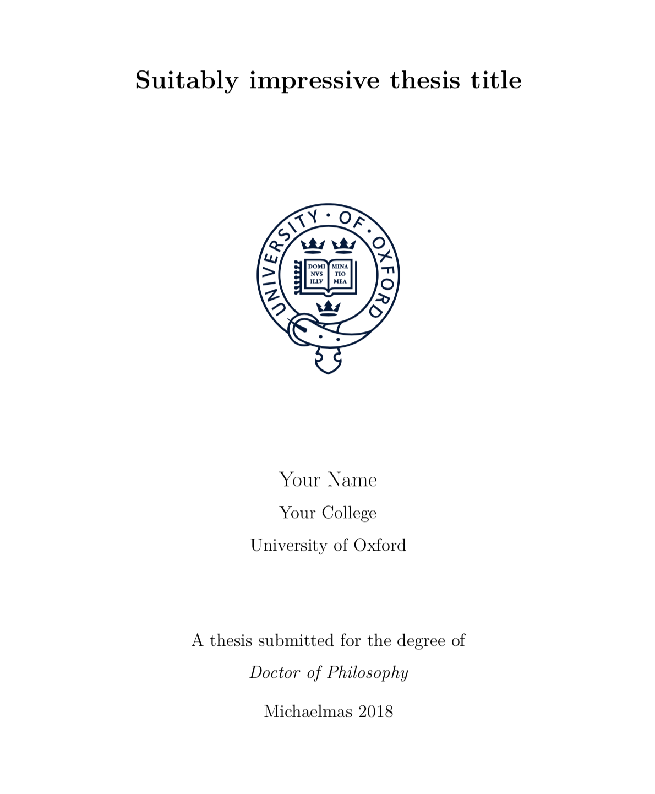

---
#########################################
# options for knitting a single chapter #
#########################################
output:
  bookdown::html_document2: default
  bookdown::word_document2: default
  bookdown::pdf_document2:
    template: templates/brief_template.tex
documentclass: book
bibliography: references.bib
---

# Introduction {-}

\adjustmtc 
<!-- For PDF output, we must include this LaTeX command after unnumbered headings, otherwise the numbers in the mini table of contents will be incorrect -->

<!-- this adds an image in gitbook output --> 

Welcome to the *R Markdown* Oxford University thesis template. 
This sample content is adapted from [`thesisdown`](https://github.com/ismayc/thesisdown) and the formatting of PDF output is adapted from the [OxThesis LaTeX template](https://github.com/mcmanigle/OxThesis). 
Hopefully, writing your thesis in R Markdown will provide a nicer interface to the OxThesis template if you haven't used TeX or LaTeX before.
More importantly, using *R Markdown* allows you to embed chunks of code directly into your thesis and generate plots and tables directly from the underlying data, avoiding copy-paste steps. 
This will get you into the habit of doing reproducible research, which benefits you long-term as a researcher, but also will greatly help anyone that is trying to reproduce or build upon your results down the road.

Using LaTeX together with *Markdown* is more consistent than the output of a word processor, much less prone to corruption or crashing, and the resulting file is smaller than a Word file. 
While you may never have had problems using Word in the past, your thesis is likely going to be about twice as large and complex as anything you've written before, taxing Word's capabilities.

## Why use it? {-}
*R Markdown* creates a simple and straightforward way to interface with the beauty of LaTeX.
Packages have been written in **R** to work directly with LaTeX to produce nicely formatting tables and paragraphs. 
In addition to creating a user friendly interface to LaTeX, *R Markdown* allows you to read in your data, analyze it and to visualize it using **R**, **Python** or other languages, and provide documentation and commentary on the results of your project.  
Further, it allows for results of code output to be passed inline to the commentary of your results.
You'll see more on this later, focusing on **R**. If you are more into **Python** or something else, you can still use *R Markdown* - see ['Other language engines'](https://bookdown.org/yihui/rmarkdown/language-engines.html) in Yihui Xie's [*R Markdown: The Definitive Guide*](https://bookdown.org/yihui/rmarkdown/language-engines.html).

<!-- 
Having your code and commentary all together in one place has a plethora of benefits!
-->

## Who should use it? {-}
Anyone who needs to use data analysis, math, tables, a lot of figures, complex cross-references, or who just cares about reproducibility in research can benefit from using *R Markdown*. 
If you are working in 'softer' fields, the user-friendly nature of the *Markdown* syntax and its ability to keep track of and easily include figures, automatically generate a table of contents, index, references, table of figures, etc. should still make it of great benefit to your thesis project.